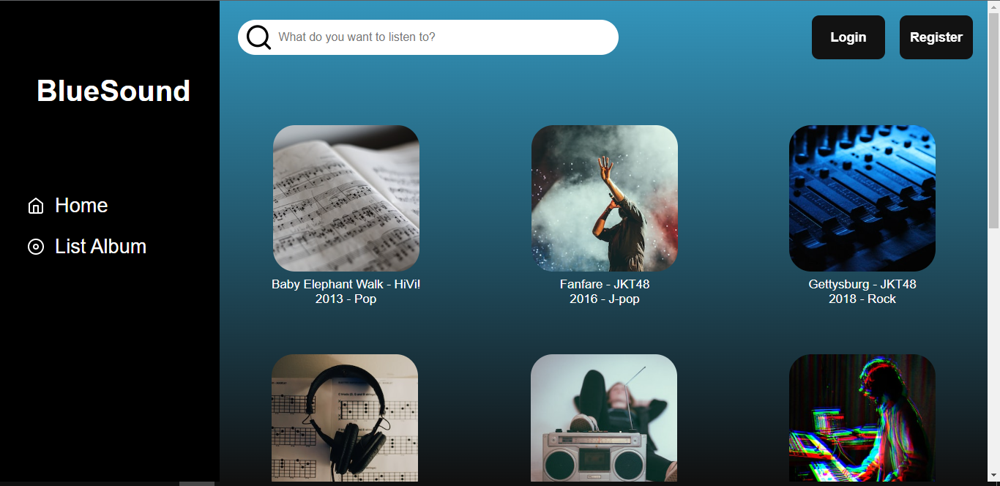
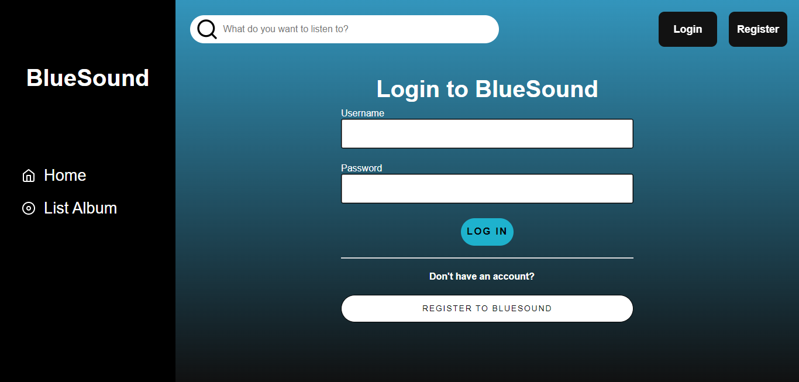
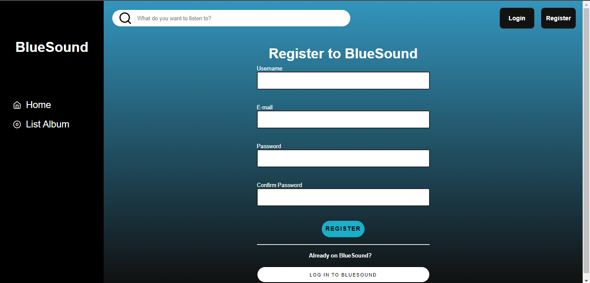
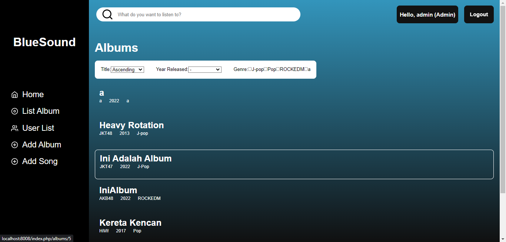
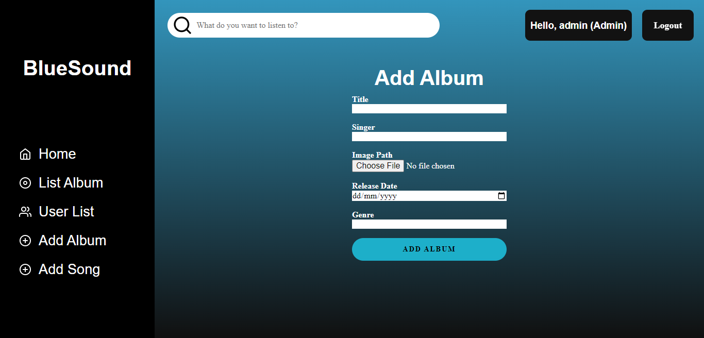
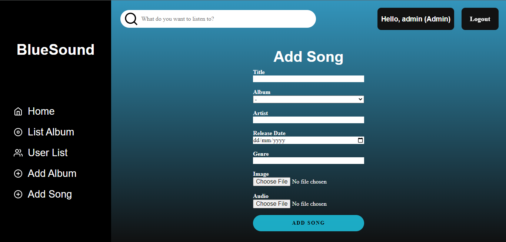
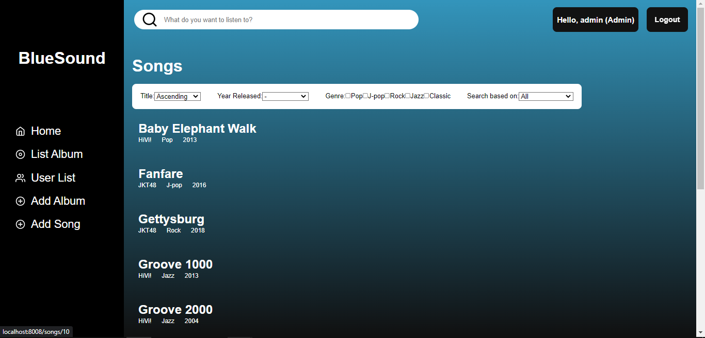
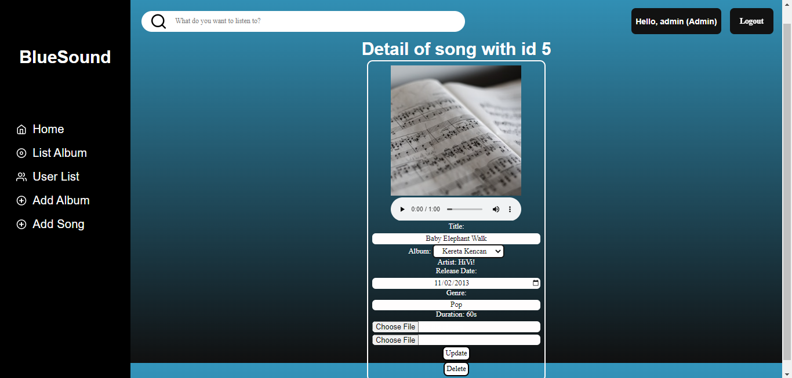
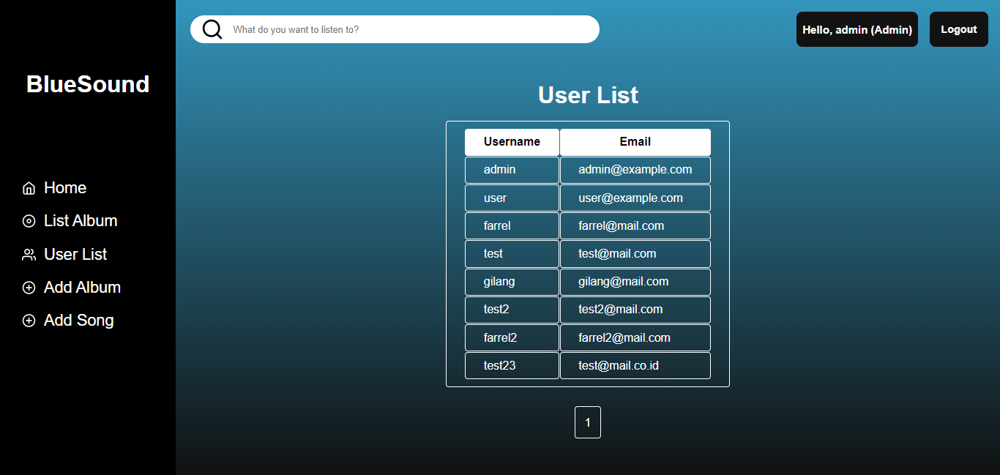

# BlueSound

|     Nama                  |      NIM       |
|---------------------------|----------------|
|Farrel Ahmad               |    13520110    |
|Ignasius Ferry Priguna     |    13520126    |
|Muhammad Gilang Ramadhan   |    13520137    |

## Deskripsi
BlueSound adalah aplikasi pemutar musik berbasis web. Pada pemutar musik ini pengguna terdaftar dapat memutar musik sepuasnya. Akan tetapi pengguna tidak terdaftar hanya dapat memutar musik 3 kali dalam satu harinya.

<br>

## Requirements
1. Docker
2. Git

<br>

## Instalasi
1. Lakukan clone pada repository ini
```sh
git clone https://gitlab.informatika.org/if3110-2022-k02-01-30/if-3110-2022-k-02-01-30.git
```

2. Pindah ke directory repository
```sh
cd if-3110-2022-k-02-01-30
```

3. Build aplikasi melalui docker
```sh
docker-compose build
```

4. Jalankan aplikasi melalui docker
```sh
docker-compose up
```

5. Setelah itu aplikasi akan berjalan di localhost anda pada port 8008. Buka browser dan masukkan `localhost:8008` pada url. Aplikasi juga bisa dapat dijalankan pada device lain dengan mengganti localhost dengan IP Address tempat menjalankan server. Sebagai contoh, IP address tempat menjalankan aplikasi adalah `192.168.1.101`. Maka, aplikasi dapat dibuka di device lain seperti handphone ataupun komputer lainnya dengan memasukkan `192.168.1.101:8008` pada url browser device tersebut.

6. Login ke dalam aplikasi. Akun admin dapat digunakan dengan memasukkan username : admin, password : admin. Terdapat juga akun user dengan username : user, password : user.

7. Register untuk membuat akun user baru.

<br>

## Screenshot 

<br>

<br>

<br>

<br>

<br>

<br>

<br>

<br>

<br>


## Pembagian Tugas
<!-- TODO: -->
**Server-side**

Login : 13520110, 13520126, 13520137
Register : 13520110, 13520126, 13520137

Home : 13520110, 13520126, 13520137

Daftar Album :13520110, 13520126, 13520137

Search, Sort, Filter :13520110, 13520126, 13520137

Detail Lagu :13520110, 13520126, 13520137

Detail Album :13520110, 13520126, 13520137

Tambah Album/Lagu : 13520110, 13520126, 13520137

Daftar User :13520110, 13520126, 13520137

Database : 13520110, 13520126, 13520137

<br>

**Client-side**

Login : 13520110, 13520126, 13520137
Register : 13520110, 13520126, 13520137

Home :13520110, 13520126, 13520137

Daftar Album :13520110, 13520126, 13520137
Search, Sort, Filter :13520110, 13520126, 13520137

Detail Lagu :13520110, 13520126, 13520137

Detail Album :13520110, 13520126, 13520137

Tambah Album/Lagu : 13520110, 13520126, 13520137

Daftar User :13520110, 13520126, 13520137
